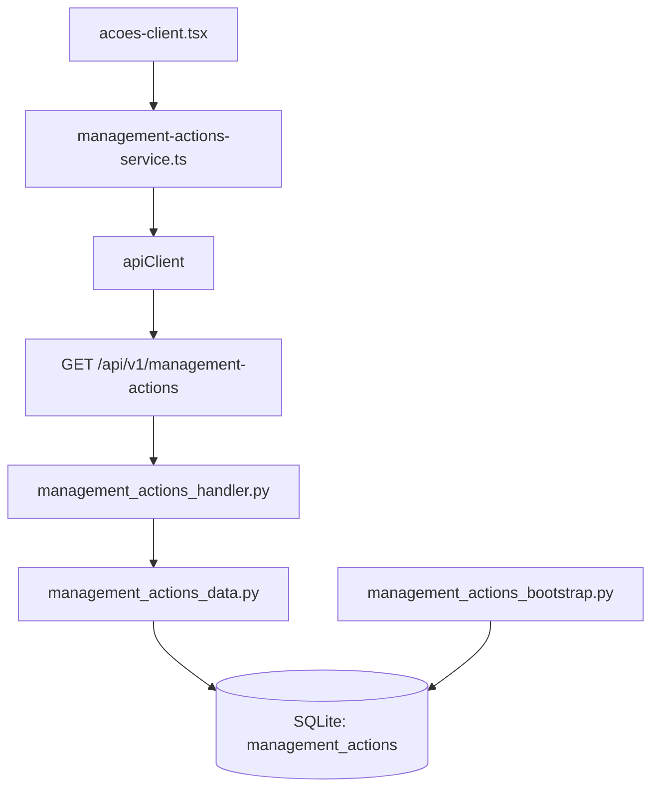

# Management Actions — Design

**Spec**: `.specs/features/management-actions/spec.md`
**Status**: Implemented

---

## Architecture Overview

Frontend `/acoes` → `managementActionsService.getActions()` → `GET /api/v1/management-actions` → `ManagementActionHandler` → `ManagementActionData` → SQLite `management_actions` table.

Nenhuma alteração arquitetural — segue padrão feature-first existente (`institucional`, `obra`).

---

## Code Reuse Analysis

### Existing Components to Leverage

| Component | Location | How to Use |
|---|---|---|
| `apiClient` singleton | `frontend/services/api.ts` | Importar e usar `get<ActionListResponse>()` |
| `get_db` dependency | `backend/shared/database/connection.py` | Injetar via `Depends(get_db)` no handler |
| `Base` declarative | `backend/shared/database/models.py` | Herdar em `ManagementActionModel` |
| Feature file structure | `backend/features/institucional/` | Copiar padrão: types, handler, data, bootstrap |
| Service pattern | `frontend/services/institucional-service.ts` | Copiar padrão: ENDPOINT const + objeto com métodos |
| Types barrel | `frontend/types/index.ts` | Adicionar re-export `management-actions` |

### Integration Points

| System | Integration Method |
|---|---|
| `main.py` router registration | `from backend.features.management_actions.management_actions_handler import router as management_actions_router` → `app.include_router(management_actions_router, prefix="/api/v1")` |
| ORM model discovery | Import `ManagementActionModel` em `backend/shared/database/models.py` para Alembic autogenerate |
| Frontend page `/acoes` | Substituir `import { actions } from './constants'` por `useQuery` chamando `managementActionsService.getActions()` |

---

## Components

### Backend: Pydantic Types

- **Purpose**: Schemas de request/response para ações da gestão
- **Location**: `backend/features/management_actions/management_actions_types.py`
- **Interfaces**:
  - `ActionStatus(StrEnum)` — `CONCLUIDA = "concluída"`, `EM_ANDAMENTO = "em andamento"`
  - `ActionRecord(BaseModel)` — resposta unitária (todos os campos visíveis + `investment` computado)
  - `ActionListResponse(BaseModel)` — wrapper `items: list[ActionRecord]` + `total: int`
- **Dependencies**: Pydantic v2 `BaseModel`, `StrEnum`
- **Reuses**: Padrão de `institucional_types.py` — `*Record` + `*ListResponse`

### Backend: ORM Model

- **Purpose**: Tabela `management_actions` no SQLite
- **Location**: `backend/shared/database/management_actions_models.py`
- **Interfaces**: `ManagementActionModel(Base)` com colunas: id, title, description, category, category_icon, investment_raw, impact_label, impact_number, impact_suffix, image, month, year, status, color, progress, created_at, updated_at
- **Dependencies**: SQLAlchemy `Column`, tipos (`Integer`, `String`, `Text`, `Float`, `DateTime`, `func`)
- **Reuses**: `Base` de `backend/shared/database/models.py`

### Backend: Data Layer

- **Purpose**: Operações CRUD no banco para `ManagementActionModel`
- **Location**: `backend/features/management_actions/management_actions_data.py`
- **Interfaces**:
  - `list_actions(db: Session, category: str | None) -> tuple[list[ManagementActionModel], int]`
  - `action_to_dict(model: ManagementActionModel) -> dict[str, Any]` — inclui `investment` formatado
- **Dependencies**: `Session` do SQLAlchemy
- **Reuses**: Padrão de `institucional_data.py` — retorna tuple (items, total)

### Backend: Handler (Router)

- **Purpose**: Endpoint REST para ações da gestão
- **Location**: `backend/features/management_actions/management_actions_handler.py`
- **Interfaces**:
  - `GET /management-actions` → `ActionListResponse` (query param opcional: `?category=`)
- **Dependencies**: FastAPI `APIRouter`, `Depends(get_db)`
- **Reuses**: Padrão de `institucional_handler.py` — router com prefixo, injeção de `db: Session`

### Backend: Bootstrap (Seed)

- **Purpose**: Inserir 7 ações mockadas no banco na inicialização (idempotente)
- **Location**: `backend/features/management_actions/management_actions_bootstrap.py`
- **Interfaces**: `seed_management_actions(db: Session) -> None`
- **Dependencies**: `management_actions_data.create_action()`
- **Reuses**: Padrão de seed data de `institucional` (se existir) ou lógica inline de upsert

### Frontend: Types

- **Purpose**: Tipos TypeScript espelhando Pydantic `ActionRecord` e `ActionListResponse`
- **Location**: `frontend/types/management-actions.ts`
- **Interfaces**:
  - `ManagementAction` — espelha `ActionRecord` (todos os campos)
  - `ManagementActionListResponse` — `{ items: ManagementAction[], total: number }`
- **Dependencies**: Nenhuma
- **Reuses**: Padrão de `frontend/types/institucional.ts`

### Frontend: Service

- **Purpose**: Chamadas à API de management actions
- **Location**: `frontend/services/management-actions-service.ts`
- **Interfaces**:
  - `managementActionsService.getActions(category?: string) → Promise<ManagementActionListResponse>`
- **Dependencies**: `apiClient` de `@/services/api`
- **Reuses**: Padrão de `frontend/services/institucional-service.ts`

### Frontend: Page Update

- **Purpose**: Substituir dados mockados por chamada real à API
- **Location**: `frontend/app/acoes/acoes-client.tsx` (modificar) + `frontend/app/acoes/constants.ts` (modificar)
- **Dependencies**: `managementActionsService`, `@tanstack/react-query`
- **Reuses**: Componentes visuais existentes (`DashboardCard`, `DonutChart`, `AnimatedCounter`) — inalterados

---

## Data Models

### DB Table: `management_actions`

| Column | Type | Constraints |
|---|---|---|
| id | INTEGER | PK, autoincrement |
| title | VARCHAR(255) | NOT NULL |
| description | TEXT | NULLABLE |
| category | VARCHAR(100) | NOT NULL |
| category_icon | VARCHAR(100) | NOT NULL |
| investment_raw | FLOAT | NOT NULL, DEFAULT 0.0 |
| impact_label | VARCHAR(100) | NOT NULL |
| impact_number | FLOAT | NOT NULL, DEFAULT 0.0 |
| impact_suffix | VARCHAR(50) | NOT NULL, DEFAULT '' |
| image | VARCHAR(500) | NULLABLE |
| month | VARCHAR(50) | NOT NULL |
| year | VARCHAR(4) | NOT NULL |
| status | VARCHAR(50) | NOT NULL, DEFAULT 'em andamento' |
| color | VARCHAR(7) | NOT NULL |
| progress | FLOAT | NOT NULL, DEFAULT 0.0 |
| created_at | DATETIME | server_default func.now() |
| updated_at | DATETIME | server_default func.now(), onupdate func.now() |

### Pydantic → TypeScript Mapping

| Pydantic (`ActionRecord`) | TypeScript (`ManagementAction`) |
|---|---|
| `id: int` | `id: number` |
| `title: str` | `title: string` |
| `description: str \| None` | `description: string \| null` |
| `category: str` | `category: string` |
| `category_icon: str` | `category_icon: string` |
| `investment: str` | `investment: string` |
| `investment_raw: float` | `investment_raw: number` |
| `impact_label: str` | `impact_label: string` |
| `impact_number: float` | `impact_number: number` |
| `impact_suffix: str` | `impact_suffix: string` |
| `image: str \| None` | `image: string \| null` |
| `month: str` | `month: string` |
| `year: str` | `year: string` |
| `status: ActionStatus` | `status: 'concluída' \| 'em andamento'` |
| `color: str` | `color: string` |
| `progress: float` | `progress: number` |

---

## Error Handling Strategy

| Error Scenario | Handling | User Impact |
|---|---|---|
| DB offline | FastAPI retorna 500 | Frontend exibe toast/mensagem de erro |
| Tabela não existe | FastAPI retorna 500 | Frontend exibe estado de erro |
| Banco vazio (zero rows) | Retorna `items: [], total: 0` | Frontend exibe "Nenhuma ação encontrada" |
| Network error (frontend) | React Query `isError` state | Componente mostra `Alert` de erro com botão retry |
| Query em loading | React Query `isLoading` state | Skeleton/spinner durante o fetch |

---

## Tech Decisions

| Decision | Choice | Rationale |
|---|---|---|
| Nome da feature backend | `management_actions` | Convenção: inglês técnico para módulos, mesmo com URL `/acoes` em PT-BR |
| Computar `investment` no backend | `to_dict()` formata `investment_raw` como "R$ X.XXX.XXX" | Single source of truth; frontend não duplica lógica de formatação |
| Filtrar categoria no backend vs frontend | Backend aceita `?category=` opcional, frontend mantém filtro client-side | API suporta filtro para uso futuro (admin, mobile); frontend mantém UX atual com `useMemo` |
| React Query vs fetch simples | React Query (`useQuery`) | Projeto já usa TanStack React Query; caching, retry, loading/error states built-in |
| Manter `image` como nome do campo | Usar `image` (não `image_url`) | Campo é claro no contexto do modelo `ManagementAction`; evita alterar componente existente |
